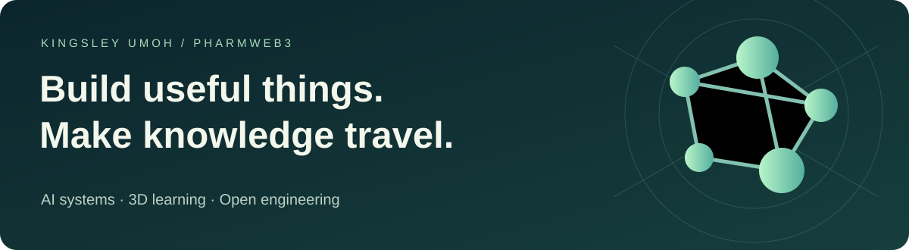

# Kingsley Umoh

**AI product engineer · Full-stack developer · PharmWeb3 founder · Pharmacy student**

I build software around problems in healthcare, education and everyday work. My focus is practical: turn a difficult question into a useful product, make its behavior understandable, and show the evidence behind the result.

This is also a place to learn. Explore a game, run an engineering lab, or use a guide to build something of your own.

[Portfolio](https://pharmweb3.com/portfolio) · [X / Twitter](https://x.com/Profkingkeys) · [LinkedIn](https://www.linkedin.com/in/prof-king-keys-110a24229)

## Start here

### Learn to build with AI

[**The Practical AI Library →**](https://github.com/Profkingkeys/Ai-ebooks)

32 practical guides across coding, data analysis, healthcare, creative work, business and advanced AI research. Includes setup, model selection, worked exercises, sources and an offline reader.

[Download the reader](https://github.com/Profkingkeys/Ai-ebooks/releases/latest/download/AI-Library.html) · [Data Analysis with AI](https://github.com/Profkingkeys/Ai-ebooks/blob/main/chapters/32-data-analysis-with-ai.md) · [Code across the stack](https://github.com/Profkingkeys/Ai-ebooks/blob/main/chapters/09-vibecoding.md)

### Practice in a 3D world

[**Pharma Simulation →**](https://github.com/Profkingkeys/Pharma-Simulation)

A complete browser campaign covering fictional suspension, ointment and solution dispensing workflows. A furnished lab, visible decisions, feedback, retry and independent-release checks. An educational prototype awaiting pharmacy/curriculum validation.

[Download the offline game](https://github.com/Profkingkeys/Pharma-Simulation/releases/latest/download/Pharma-Simulation.html)

[**KidSim →**](https://github.com/Profkingkeys/Kid-Simulation)

A 3D home adventure with five healthy-habit missions: handwashing, medicine safety, cough care, safe drinking water and hot cookware. Automatic character movement, a timed handwashing routine and gentle retries. No account or tracking.

[Download the offline game](https://github.com/Profkingkeys/Kid-Simulation/releases/latest/download/Kid-Simulation.html) · [Explore the simulation collection](https://github.com/Profkingkeys/Simulation-Games)

### Inspect the engineering

[**PharmWeb3 →**](https://github.com/Profkingkeys/PharmWeb3)

Runnable labs for AI tool routing, SaaS boundaries, MySQL, paper-trading research, telemetry and Android. Source, tests and CI make the implementation reviewable. These are engineering demonstrations, not claims of production scale or clinical deployment.

[Run the labs](https://github.com/Profkingkeys/PharmWeb3#run-the-labs) · [Build and APK evidence](https://github.com/Profkingkeys/PharmWeb3/actions/workflows/ci.yml)

## How I build and lead

1. **Understand the problem.** Identify the user, the current workaround and the cost of getting it wrong.
2. **Ship a complete small loop.** Make the main task usable before expanding the feature list.
3. **Make evidence visible.** Preserve sources, tests, limitations and a reproducible demonstration.
4. **Improve with others.** Invite users and domain experts to challenge assumptions and guide the next release.

[Leadership principles](LEADERSHIP.md) · [Portfolio evidence](PORTFOLIO.md) · [Technology map](STACK.md)

## Technologies in this portfolio

**Web & 3D:** HTML, CSS, JavaScript, Node.js, Three.js, WebGL, responsive interfaces and explicit game-state models.

**AI & data:** tool interfaces, model evaluation patterns, Python data validation, MySQL, source-grounded workflows and structured telemetry.

**Mobile & delivery:** Kotlin, Java, Android WebView, Gradle, emulator checks, GitHub Actions and static/offline publishing.

**Learning examples:** Rust validation, Solidity contracts and cross-stack development guides. **Research direction:** Filament rendering, biomedical evidence tools and better evaluation of advanced AI. These directions are distinct from shipped features.

## Current checks

## Collaborate

Open to software roles, healthcare and education projects, research tooling, technical writing, and thoughtful founder collaborations. Contributors can help with accessibility, curriculum review, scenario design, source verification and reproducible examples.

**Find an overlooked problem. Build something useful. Let the evidence speak.**
