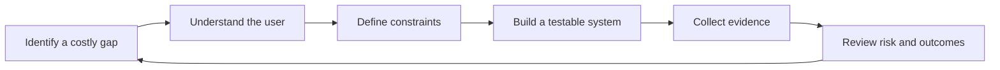

# Kingsley Umoh

### AI Product Engineer · Full-Stack Developer · Simulation Builder · Prompt Engineer · Founder · Pharmacy Student

I build inspectable software around difficult problems in healthcare, education, AI safety, automation, and emerging technology. My strongest work sits where domain knowledge meets product engineering: AI systems with permission boundaries, 3D learning simulations, multi-tenant APIs, mobile bridges, data infrastructure, and measurable evaluation.

**Current thesis:** advanced AI becomes valuable when it is connected to a real problem, constrained by evidence and policy, and designed so people can understand what it did.

[Portfolio](https://pharmweb3.com/portfolio) · [Flagship engineering lab](https://github.com/Profkingkeys/PharmWeb3) · [AI field guide](https://github.com/Profkingkeys/Ai-ebooks) · [Simulation program](https://github.com/Profkingkeys/Simulation-Games)

## Building now

| Product | Problem | System | Proof |
|---|---|---|---|
| [Pharma Simulation](https://github.com/Profkingkeys/Pharma-Simulation) | Pharmacy learners need safe practice before real preparation | Three.js extemporaneous-dispensing game with a deterministic state engine | playable loop, tests, CI, safety boundaries |
| [KidSim](https://github.com/Profkingkeys/Kid-Simulation) | Health education is often abstract and forgettable | 3D healthy-home campaign with age-appropriate decisions | three missions, tests, CI, privacy principles |
| [PharmWeb3](https://github.com/Profkingkeys/PharmWeb3) | Healthcare access and AI workflows need accountable infrastructure | AI, SaaS, paper-trading, Android, MySQL, and OTLP engineering labs | runnable demos, contracts, evaluation, telemetry |
| [AI: The New Operating Layer](https://github.com/Profkingkeys/Ai-ebooks) | People use AI without seeing the system or failure surface | technical field guide across security, medicine, pharmacy, law, economy, and building | 12 chapters, labs, evidence method, publishing CI |

## Engineering capabilities

| Capability | Technologies and practices |
|---|---|
| **AI systems** | agents, tool calling, prompt engineering, structured outputs, provider evaluation, retrieval patterns, human-in-the-loop workflows |
| **AI safety and security** | prompt-injection threat models, scoped tools, authorization gates, evidence boundaries, audit events, model-output validation |
| **Full stack** | JavaScript, Node.js, Express, Python, FastAPI, REST, OpenAPI, authentication, Socket.IO, Netlify Functions |
| **3D and simulation** | Three.js, WebGL, game-state machines, scenario design, learning feedback, renderer-independent domain logic |
| **Mobile** | Android, Kotlin, Java, WebView, JavaScript/native bridges, instrumentation-test architecture |
| **Data** | MySQL, MongoDB, Mongoose, Supabase, relational modeling, tenant isolation |
| **Platform engineering** | Docker, GitHub Actions, GitHub Pages, automated tests, OTLP/OpenTelemetry concepts, structured telemetry |
| **Web3** | Solana-oriented architecture, token metadata, IPFS, wallets, reward-system concepts |
| **Product leadership** | problem discovery, system architecture, technical writing, safety-by-design, roadmaps, founder-led execution |

**Exploring next:** Google Filament for native high-fidelity simulation rendering, privacy-preserving learning analytics, and AI-assisted scenario adaptation. Exploration is listed separately from proven implementation.

## How I lead and build

- Start with a concrete user decision, not a technology trend.
- Separate model output from authorization and real-world action.
- Make core rules deterministic, testable, and observable.
- Label prototypes, research builds, and validated systems honestly.
- Treat privacy, accessibility, safety, and documentation as product work.
- Invite domain experts into the review loop early.

Read the longer [leadership principles](LEADERSHIP.md), [portfolio evidence map](PORTFOLIO.md), and [stack taxonomy](STACK.md).

## Selected engineering evidence

Financial systems in this portfolio default to paper or sandbox execution. Healthcare work preserves evidence, professional review, and human accountability. Simulation content is clearly labeled when it has not yet been curriculum-validated.

## Open to

AI product engineering, full-stack and platform roles, healthcare technology, learning simulation, technical collaborations, research tooling, and founder conversations around important problems worth solving.

> Find the overlooked problem. Build the system. Make the evidence visible.
